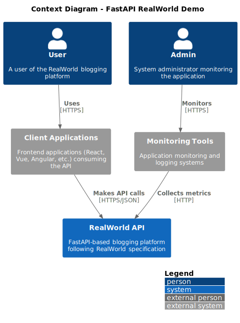
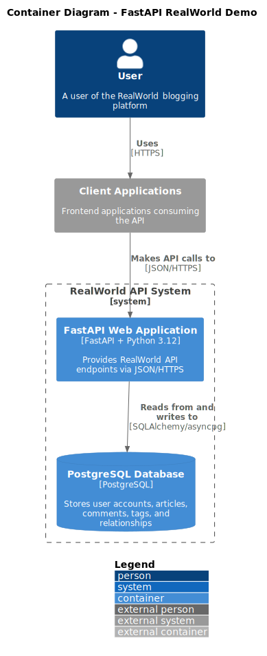
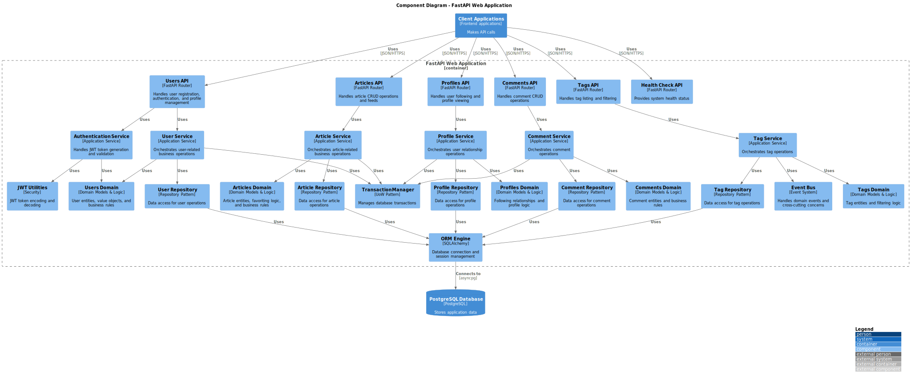

# Project Overview

> 📖 **[← Back to README](../../README.md)** | **[📋 Documentation Index](../README.md)**

### 🎪 Supported Features

### Core Functionality (Fully Implemented)
- ✅ **User Management**: Registration, authentication, profile management
- ✅ **Article System**: CRUD operations with slug-based URLs
- ✅ **Comment System**: Nested comments with CRUD operations (no update per RealWorld spec)
- ✅ **Tag System**: Article tagging and filtering capabilities

### Social Features (Fully Implemented)
- ✅ **User Following**: Follow/unfollow user relationships
- ✅ **Article Favoriting**: Like/unlike articles
- ✅ **Personalized Feeds**: Article feeds based on followed users
- ✅ **Article Pagination**: Efficient list pagination across all endpoints

### Technical Features (Fully Implemented)
- ✅ **JWT Authentication**: Secure token-based authentication
- ✅ **RealWorld API Compliance**: 100% specification compliance
- ✅ **Basic Health Check**: Simple status endpoint for container health checks
- ✅ **Interactive API Documentation**: Swagger UI and ReDoc

### Development Infrastructure (Fully Implemented)
- ✅ **Domain-Driven Design**: Clean layer separation and business logic organization
- ✅ **Event-Driven Architecture**: Domain events framework (handlers are placeholders)
- ✅ **Type Safety**: Complete MyPy validation
- ✅ **Comprehensive Testing**: Unit, integration, and E2E tests with fast fixtures
- ✅ **Transaction Management**: Automatic UoW with `@transactional()` decoratorntation Index](../README.md)**

This document provides a comprehensive overview of the FastAPI RealWorld Demo project architecture, technology choices, and design principles.

## 🎯 Project Purpose

The FastAPI RealWorld Demo is a **development-focused reference implementation** that demonstrates:

- **Modern FastAPI Development**: Latest patterns and best practices
- **Domain-Driven Design**: Clean architecture with clear boundaries
- **Development Best Practices**: Comprehensive testing, structured logging, and deployment-ready code
- **RealWorld Compliance**: Full implementation of the RealWorld API specification

## 🏗️ Architecture Overview

The FastAPI RealWorld Demo follows a clean, layered architecture based on Domain-Driven Design principles:

### System Context


The system serves multiple client applications (web, mobile, desktop) through a unified REST API, with external monitoring and analytics integrations.

### High-Level Architecture


The application consists of two main containers:
- **FastAPI Web Application**: The core application built with Python 3.12 and FastAPI
- **PostgreSQL Database**: Persistent data storage with full ACID compliance

### Internal Component Structure


The FastAPI application is organized into distinct layers:
- **API Layer**: HTTP endpoints and request/response handling
- **Service Layer**: Business use cases and transaction orchestration
- **Domain Layer**: Core business logic and entities
- **Infrastructure Layer**: Data access and external system integration
- **Shared Components**: Cross-cutting concerns (events, JWT, transactions)

## 🛠️ Technology Stack

### Core Framework
- **FastAPI 0.115+** with Pydantic v2 for API development
- **Python 3.12+** leveraging modern type hints and async features
- **SQLAlchemy 2.0** with full async support
- **PostgreSQL** with asyncpg driver for optimal performance

### Development Tools
- **Poetry** for dependency management and packaging
- **Docker & Docker Compose** for local development databases
- **Alembic** for database schema migrations
- **Make** for standardized development commands

### Quality & Testing
- **pytest** with asyncio and httpx for comprehensive testing
- **MyPy** for static type checking
- **Ruff** for code formatting and linting
- **polyfactory** for realistic test data generation

### Security & Authentication
- **JWT tokens** with passlib and bcrypt
- **Pydantic Settings** for secure configuration management
- **Environment-based configuration** for different deployment stages

## 🏗️ Architecture Highlights

### Domain-Driven Design (DDD)
- **Clean Layer Separation**: API → Service → Domain → Infrastructure
- **Pure Domain Models**: Business entities as dataclasses with no infrastructure dependencies
- **Domain Events**: Event-driven architecture for loose coupling
- **Aggregates & Bounded Contexts**: Clear business boundaries

### Advanced Patterns
- **Unit of Work (UoW)**: Automatic transaction management with `@transactional()` decorator
- **Repository Pattern**: Abstracted data access with dependency injection
- **Event-Driven Architecture**: Comprehensive event system for cross-cutting concerns
- **Exception Handling**: Standardized error handling across all domains

### Performance & Scalability
- **Async-First Design**: Full async/await throughout the application
- **Connection Pooling**: Optimized database connections
- **Efficient Testing**: Sub-50ms database cleanup with TRUNCATE CASCADE
- **Type Safety**: Compile-time validation preventing runtime errors

## 🎪 Features

### Core Functionality
- ✅ **User Management**: Registration, authentication, profile management
- ✅ **Article System**: CRUD operations with slug-based URLs
- ✅ **Comment System**: Nested comments with CRUD operations (no update)
- ✅ **Tag System**: Article tagging and filtering capabilities

### Social Features  
- ✅ **User Following**: Follow/unfollow user relationships
- ✅ **Article Favoriting**: Like/unlike articles
- ✅ **Personalized Feeds**: Article feeds based on followed users
- ✅ **Article Pagination**: Efficient list pagination across all endpoints

### Technical Features
- ✅ **JWT Authentication**: Secure token-based authentication
- ✅ **RealWorld API Compliance**: 100% specification compliance
- ✅ **Health Check Endpoints**: System monitoring and status
- ✅ **Interactive API Documentation**: Swagger UI and ReDoc

## 📁 Project Structure

```
fastapi-realworld-demo/
├── app/
│   ├── api/                   # 🌐 HTTP endpoints (FastAPI routers)
│   ├── service_layer/         # ⚙️ Use cases and orchestration  
│   ├── domain/                # 🏛️ Business logic and entities
│   │   ├── users/            # User domain (models, schemas, exceptions)
│   │   ├── articles/         # Article domain
│   │   ├── comments/         # Comment domain
│   │   ├── profiles/         # Profile domain
│   │   └── tags/             # Tag domain
│   ├── adapters/             # 🔌 Infrastructure (repositories, ORM)
│   ├── events/               # 📡 Event-driven architecture
│   ├── shared/               # 🛠️ Common utilities
│   └── config/               # ⚙️ Configuration management
├── tests/                    # 🧪 Comprehensive test suite
│   ├── unit/                 # Pure business logic tests
│   ├── integration/          # Database and API integration tests
│   └── e2e/                  # End-to-end workflow tests
├── docs/                     # 📚 Documentation
├── alembic/                  # 🗃️ Database migrations
└── scripts/                  # 🔧 Development utilities
```

## 🎛️ Layer Responsibilities

| Layer | Purpose | Examples |
|-------|---------|----------|
| **API** | HTTP interface | Request validation, response formatting, authentication |
| **Service** | Use cases & orchestration | Business workflows, transaction management, event publishing |
| **Domain** | Business logic | Entities, business rules, domain events, domain services |
| **Infrastructure** | External concerns | Database repositories, ORM mappings, external APIs |

## 🔑 Design Principles

### Clean Architecture
- **Dependency Inversion**: Core business logic doesn't depend on infrastructure
- **Single Responsibility**: Each component has one clear purpose
- **Interface Segregation**: Well-defined contracts between layers
- **Open/Closed Principle**: Extensible without modifying existing code

### Event-Driven Design
- **Loose Coupling**: Domains communicate through events, not direct calls
- **Audit Trail**: All business changes generate trackable events
- **Extensibility**: New features can listen to existing events
- **Asynchronous Processing**: Non-blocking operations for better performance

### Type Safety & Quality
- **Full Type Annotations**: MyPy validation at compile time
- **Comprehensive Testing**: Unit, integration, and E2E test coverage
- **Documentation as Code**: Docstrings and architectural decision records
- **Automated Quality Checks**: Linting, formatting, and type checking in CI/CD

### Performance Optimization
- **Async Operations**: Non-blocking I/O throughout the application
- **Database Optimization**: Connection pooling and efficient queries
- **Fast Testing**: Optimized test fixtures with sub-50ms cleanup
- **Resource Management**: Proper connection and transaction handling

## 🛡️ Security Features

### Authentication & Authorization
- **JWT Token Authentication**: Secure, stateless authentication
- **Password Hashing**: bcrypt for secure password storage
- **Token Expiration**: Configurable token lifetime
- **Environment-based Secrets**: Secure configuration management

### Data Protection
- **Input Validation**: Pydantic models for request/response validation
- **SQL Injection Prevention**: Parameterized queries via SQLAlchemy
- **Error Information Hiding**: Standardized error responses without sensitive data
- **Configuration Security**: Environment variables for sensitive settings

## 📊 Development Tools & Basic Observability

### Basic Health Monitoring
- **Health Check Endpoint**: Simple `/healthcheck` endpoint returning status
- **Structured Logging**: Python logging with configurable levels and formats
- **Database Connection Testing**: Manual connection verification via Make commands
- **Event System Foundation**: Event publishing framework ready for monitoring extensions

### Development & Debug Tools
- **Interactive API Documentation**: Real-time API exploration via Swagger UI
- **Debug-Friendly Logging**: Structured logging for troubleshooting during development
- **Test Performance Metrics**: Database cleanup and test execution timing
- **Development Database Utilities**: Connection testing and database management commands

### Monitoring Readiness (Framework Only)
> **Note**: The project provides the foundation for monitoring but doesn't include production monitoring tools out-of-the-box. The event system and structured logging provide hooks for adding:
> - Application metrics collection (Prometheus, etc.)
> - Distributed tracing (OpenTelemetry)
> - Error tracking (Sentry, etc.)
> - Performance monitoring dashboards

## 🔄 Development Workflow

### Code Quality Pipeline
1. **Type Checking**: MyPy validation for type safety
2. **Code Formatting**: Ruff for consistent formatting
3. **Linting**: Automated code quality checks
4. **Testing**: Comprehensive test suite execution
5. **Migration Testing**: Database schema validation

### Testing Strategy
- **Test Pyramid**: Unit → Integration → E2E testing layers
- **Database Isolation**: Independent test database with automatic cleanup
- **Realistic Test Data**: Factory-generated test data matching production patterns
- **Performance Testing**: Sub-50ms database operations for fast feedback

### Development Environment
- **Poetry Virtual Environments**: Isolated dependency management
- **Docker Development Databases**: Consistent database setup across environments
- **Make Commands**: Standardized development tasks
- **Hot Reloading**: Automatic application restart during development

## 🚀 Deployment Readiness

### Development-to-Production Foundation
- **Docker Support**: Basic Dockerfile for containerized deployment (development-focused)
- **Environment Configuration**: Multi-environment support via Pydantic Settings (dev/test/prod)
- **Database Migrations**: Automated schema management with Alembic
- **Basic Health Checks**: Simple health endpoint suitable for container orchestration

### Production Considerations (Requires Additional Setup)
> **Important**: This project provides a solid foundation but requires additional configuration for production:

#### Missing Production Features
- **No built-in metrics collection** (Prometheus, StatsD, etc.)
- **No distributed tracing** (OpenTelemetry, Jaeger, etc.)
- **No centralized logging** (ELK stack, cloud logging, etc.)
- **No application performance monitoring** (APM tools)
- **Basic security headers** (would need additional middleware)
- **No rate limiting** (would need Redis + middleware)

#### Production Setup Required
- **Reverse proxy configuration** (Nginx, cloud load balancer)
- **SSL/TLS termination** and certificate management
- **Production database** with connection pooling optimization
- **Monitoring and alerting** stack setup
- **Log aggregation** and analysis tools
- **Security hardening** and vulnerability scanning

### Scalability Foundation
- **Async Architecture**: Non-blocking operations ready for high concurrency
- **Connection Pooling**: Basic database connection pooling via SQLAlchemy
- **Event-Driven Design**: Framework for horizontal scaling through event processing
- **Stateless Design**: JWT-based authentication supports horizontal scaling

### Development-Focused Monitoring
- **Structured Logging**: JSON-compatible log format ready for aggregation
- **Event System**: Foundation for adding performance metrics and monitoring
- **Error Handling**: Standardized exception handling with detailed error context
- **Health Endpoint**: Basic system status monitoring suitable for container health checks

## 🔗 External Compliance

### RealWorld API Specification
- **100% Endpoint Coverage**: All required endpoints implemented
- **Exact Response Format**: Specification-compliant JSON responses
- **Authentication Patterns**: JWT token handling per specification
- **Error Response Format**: Standardized error structure

### Development Standards
- **PEP 8 Compliance**: Python style guide adherence
- **Type Annotations**: PEP 484/526 type hint compliance
- **Modern Python Features**: Python 3.12+ feature utilization
- **Async Best Practices**: Proper async/await usage patterns

## 📚 Related Documentation

- **[Getting Started](../guides/GETTING_STARTED.md)** - Quick setup and first steps
- **[Architecture Guides](../architecture/)** - Detailed design patterns and principles
- **[Development Workflow](../development/)** - Complete development process
- **[API Usage Guide](../guides/API_USAGE.md)** - Complete API reference and examples

---

> **This overview provides the foundation for understanding the project. Dive deeper into specific topics using the documentation links above.**
