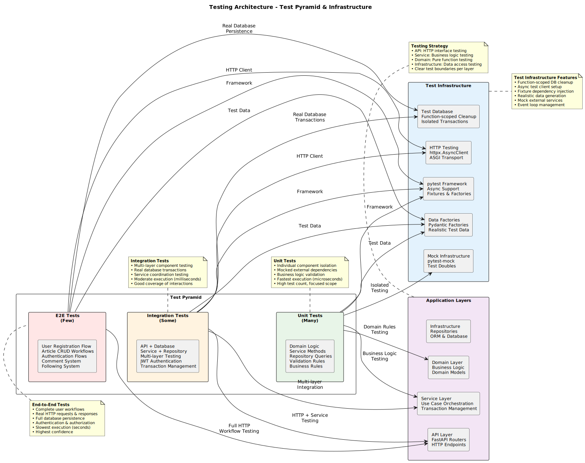

# Testing Guide

> 📖 **[← Back to README](../../README.md)** | **[📋 Documentation Index](../README.md)**

Comprehensive testing guide for the FastAPI RealWorld Demo project, covering testing strategies, best practices, and practical examples.

## Table of Contents

- [Testing Philosophy](#testing-philosophy)
- [Testing Stack](#testing-stack)
- [Test Categories](#test-categories)
- [Writing Tests](#writing-tests)
- [Running Tests](#running-tests)
- [Test Data Management](#test-data-management)
- [Mocking Strategies](#mocking-strategies)
- [Performance Testing](#performance-testing)
- [Best Practices](#best-practices)

## Testing Philosophy

Our testing approach follows these principles:

1. **Test Pyramid**: More unit tests, fewer integration tests, minimal E2E tests
2. **Fast Feedback**: Tests should run quickly (full suite < 30 seconds)
3. **Reliable**: Tests should be deterministic and not flaky
4. **Maintainable**: Tests should be easy to understand and modify
5. **Realistic**: Use realistic test data that reflects production scenarios

## Testing Stack

### Core Technologies

- **pytest**: Main testing framework with async support
- **pytest-asyncio**: Async test execution
- **httpx**: HTTP client for API testing (replaces requests)
- **pytest-mock**: Mocking framework (preferred over unittest.mock)
- **polyfactory**: Test data generation (replaces pydantic-factories)
- **aiosqlite**: In-memory database for fast tests
- **asgi-lifespan**: Application lifecycle management for tests

### Test Configuration

```python
# pytest.ini
[tool:pytest]
asyncio_mode = auto
testpaths = tests
python_files = test_*.py
python_classes = Test*
python_functions = test_*
```

## Test Categories

Our testing strategy follows the test pyramid pattern, balancing thorough coverage with fast execution:



The diagram shows the relationship between different test types and their coverage:
- **Unit Tests**: Fast, isolated tests with mocked dependencies
- **Integration Tests**: Multi-layer tests with real database
- **E2E Tests**: Complete user workflow tests
- **Test Infrastructure**: Shared fixtures, factories, and utilities

### 1. Unit Tests (`tests/unit/`)

Test individual components in isolation with mocked dependencies.

```python
import pytest
from unittest.mock import AsyncMock
from app.service_layer.users.authentication import authenticate_user
from app.domain.users.exceptions import InvalidCredentialsError

async def test_authenticate_user_success(mocker):
    """
    GIVEN: Valid email and password
    WHEN: authenticate_user is called
    THEN: User is returned successfully
    """
    # Given
    mock_uow = mocker.Mock()
    mock_repo = mocker.Mock()
    mock_uow.session = mocker.Mock()
    mock_repo.get_by_email.return_value = create_test_user()
    
    # When
    with mocker.patch('app.service_layer.users.authentication.UserRepository', return_value=mock_repo):
        result = await authenticate_user(mock_uow, "test@example.com", "password")
    
    # Then
    assert result.email == "test@example.com"
```

### 2. Integration Tests (`tests/integration/`)

Test components working together with real database but controlled environment.

```python
import pytest
from httpx import AsyncClient, ASGITransport
from app.main import app

async def test_create_user_integration():
    """
    GIVEN: Valid user registration data
    WHEN: POST /api/users is called
    THEN: User is created and returned with correct data
    """
    # Given
    user_data = {
        "user": {
            "username": "newuser",
            "email": "newuser@example.com",
            "password": "securepassword123"
        }
    }
    
    # When
    async with AsyncClient(transport=ASGITransport(app=app), base_url="http://test") as client:
        response = await client.post("/api/users", json=user_data)
    
    # Then
    assert response.status_code == 201
    data = response.json()
    assert data["user"]["username"] == "newuser"
    assert data["user"]["email"] == "newuser@example.com"
    assert "token" in data["user"]
```

### 3. End-to-End Tests (`tests/e2e/`)

Test complete user workflows from start to finish.

```python
async def test_complete_user_workflow():
    """
    GIVEN: A new user wants to use the platform
    WHEN: They register, create an article, and interact with it
    THEN: All operations work seamlessly together
    """
    async with AsyncClient(transport=ASGITransport(app=app), base_url="http://test") as client:
        # Register user
        user_data = {"user": {"username": "blogger", "email": "blogger@example.com", "password": "pass123"}}
        register_response = await client.post("/api/users", json=user_data)
        assert register_response.status_code == 201
        token = register_response.json()["user"]["token"]
        
        # Create article
        headers = {"Authorization": f"Token {token}"}
        article_data = {
            "article": {
                "title": "Test Article",
                "description": "A test article",
                "body": "This is the body of the test article",
                "tagList": ["test", "article"]
            }
        }
        article_response = await client.post("/api/articles", json=article_data, headers=headers)
        assert article_response.status_code == 201
        
        # Verify article in feed
        feed_response = await client.get("/api/articles", headers=headers)
        assert feed_response.status_code == 200
        assert len(feed_response.json()["articles"]) == 1
```

## Writing Tests

### Test Structure (Given-When-Then)

Always structure tests with clear Given-When-Then sections:

```python
async def test_user_login_success():
    """
    GIVEN: An existing user with valid credentials
    WHEN: User attempts to login
    THEN: Authentication succeeds and token is returned
    """
    # Given
    user_data = create_test_user_data()
    # Setup existing user...
    
    # When
    response = await client.post("/api/users/login", json=login_data)
    
    # Then
    assert response.status_code == 200
    assert "token" in response.json()["user"]
```

### Async Test Patterns

```python
# Correct async test pattern
@pytest.mark.asyncio
async def test_async_operation():
    result = await some_async_function()
    assert result.is_valid

# Or with pytest-asyncio auto mode (recommended)
async def test_async_operation():  # No decorator needed
    result = await some_async_function()
    assert result.is_valid
```

### Error Testing

```python
async def test_user_not_found_error():
    """
    GIVEN: Non-existent user ID
    WHEN: Getting user by ID
    THEN: UserNotFoundError is raised
    """
    # Given
    non_existent_id = 99999
    
    # When/Then
    with pytest.raises(UserNotFoundError) as exc_info:
        await get_user_by_id(non_existent_id)
    
    assert str(exc_info.value) == f"User with id {non_existent_id} not found"
```

## Running Tests

### Basic Test Execution

```bash
# Run all tests
make test
pytest

# Run specific test file
pytest tests/integration/test_users.py

# Run specific test function
pytest tests/integration/test_users.py::test_create_user_success

# Run with verbose output
pytest -v

# Run with output (don't capture stdout)
pytest -s
```

### Test Categories

```bash
# Unit tests only
make test-unit
pytest tests/unit/

# Integration tests only
make test-integration
pytest tests/integration/

# End-to-end tests only
make test-e2e
pytest tests/e2e/
```

### Test Coverage

```bash
# Run with coverage
make test-cov
pytest --cov=app --cov-report=html

# View coverage report
open htmlcov/index.html
```

### Debugging Tests

```bash
# Drop into debugger on failure
pytest --pdb

# Drop into debugger on first failure
pytest -x --pdb

# Run last failed tests only
pytest --lf
```

## Test Data Management

### Using Factories

We use Polyfactory for generating realistic test data:

```python
# tests/factories.py
from polyfactory import ModelFactory
from app.domain.users.models import User

class UserFactory(ModelFactory[User]):
    __model__ = User
    
    username = "testuser"
    email = "test@example.com"
    bio = "Test user bio"

# Usage in tests
def test_user_creation():
    # Create user with defaults
    user = UserFactory.build()
    
    # Override specific fields
    user = UserFactory.build(username="customuser", email="custom@example.com")
    
    # Create multiple users
    users = UserFactory.batch(5)
```

### Database Fixtures

```python
# conftest.py
@pytest.fixture
async def clean_db():
    """Ensure clean database state for each test."""
    # Database is automatically cleaned between tests
    # via function-scoped engine reset
    yield

@pytest.fixture
async def test_user(clean_db):
    """Create a test user in the database."""
    async with AsyncUnitOfWork() as uow:
        repo = UserRepository(uow.session)
        user_data = UserFactory.build()
        user = await repo.create(user_data)
        await uow.commit()
        return user
```

## Mocking Strategies

### Repository Mocking (Unit Tests)

```python
async def test_get_user_service(mocker):
    """Test user service with mocked repository."""
    # Given
    mock_repo = mocker.Mock()
    mock_repo.get_by_id.return_value = UserFactory.build(id=1)
    
    # When
    with mocker.patch('app.service_layer.users.service.UserRepository', return_value=mock_repo):
        result = await get_user_by_id(uow=mocker.Mock(), user_id=1)
    
    # Then
    assert result.id == 1
    mock_repo.get_by_id.assert_called_once_with(1)
```

### Authentication Mocking

```python
@pytest.fixture
def mock_auth(mocker):
    """Mock authentication for tests that don't need real auth."""
    test_user = UserFactory.build()
    mocker.patch('app.shared.jwt.get_current_user', return_value=test_user)
    return test_user

async def test_protected_endpoint(client, mock_auth):
    """Test endpoint with mocked authentication."""
    response = await client.get("/api/user")
    assert response.status_code == 200
```

### External Service Mocking

```python
async def test_email_service_mock(mocker):
    """Test email sending with mocked external service."""
    mock_send = mocker.patch('app.services.email.send_email')
    
    await send_welcome_email("user@example.com")
    
    mock_send.assert_called_once_with(
        to="user@example.com",
        subject="Welcome!",
        template="welcome"
    )
```

## Performance Testing

### Database Performance

```python
import time
import pytest

async def test_database_query_performance():
    """Ensure database queries perform within acceptable limits."""
    start_time = time.time()
    
    # Execute database operation
    users = await list_users(limit=100)
    
    execution_time = time.time() - start_time
    assert execution_time < 0.1  # Should complete in less than 100ms
    assert len(users) <= 100
```

### Load Testing (Optional)

```python
import asyncio

async def test_concurrent_user_creation():
    """Test system handles concurrent operations."""
    async def create_user(client, index):
        user_data = {"user": UserFactory.build(username=f"user{index}").__dict__}
        return await client.post("/api/users", json=user_data)
    
    # Create 10 users concurrently
    async with AsyncClient(transport=ASGITransport(app=app)) as client:
        tasks = [create_user(client, i) for i in range(10)]
        responses = await asyncio.gather(*tasks)
    
    # All should succeed
    assert all(r.status_code == 201 for r in responses)
```

## Best Practices

### Test Organization

1. **One Test Per Behavior**: Each test should verify one specific behavior
2. **Descriptive Names**: Test names should clearly describe what is being tested
3. **Arrange-Act-Assert**: Structure tests with clear setup, execution, and verification
4. **Independent Tests**: Tests should not depend on each other

### Test Data

1. **Use Factories**: Generate realistic test data with factories
2. **Override When Needed**: Override factory defaults for specific test scenarios
3. **Clean State**: Ensure each test starts with a clean database state
4. **Realistic Data**: Use data that resembles production scenarios

### Mocking Guidelines

1. **Mock Infrastructure**: Mock external dependencies and infrastructure
2. **Don't Mock Domain Logic**: Test business logic with real implementations
3. **Verify Interactions**: Assert that mocked methods are called correctly
4. **Use pytest-mock**: Prefer pytest-mock over unittest.mock

### Performance Considerations

1. **Fast Tests**: Keep test execution time minimal
2. **Parallel Execution**: Write tests that can run in parallel
3. **Efficient Fixtures**: Use function-scoped fixtures when possible
4. **Database Optimization**: Use in-memory database for unit tests

### Common Pitfalls

1. **Async/Await**: Always use async/await for async functions in tests
2. **Database Cleanup**: Ensure database state is reset between tests
3. **Fixture Scope**: Use appropriate fixture scope (function vs session)
4. **Mock Isolation**: Don't let mocks leak between tests

### Test Documentation

```python
async def test_user_registration_validation():
    """
    Test user registration input validation.
    
    GIVEN: Invalid user registration data (missing required fields)
    WHEN: POST /api/users is called with invalid data
    THEN: Validation error is returned with appropriate error messages
    
    This test ensures that the API properly validates user input and
    returns meaningful error messages for invalid registration attempts.
    """
    # Test implementation...
```

## Continuous Integration

Tests run automatically on:

- **Pull Requests**: Full test suite execution
- **Main Branch**: All tests plus additional checks
- **Scheduled**: Nightly full test runs with performance benchmarks

### Local CI Simulation

```bash
# Run the same checks as CI
make ci-check

# This includes:
# - Linting (ruff)
# - Type checking (mypy)
# - All tests with coverage
# - Security checks
```

For more testing examples, explore the `tests/` directory in the project.
